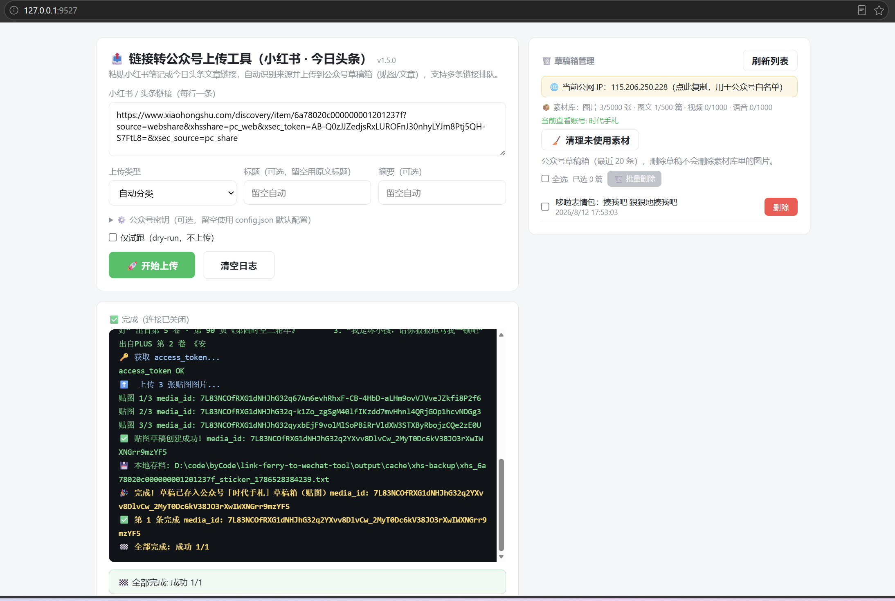

# link-ferry-to-wechat-tool - 202607

# 小红书/头条 → 公众号 工具（独立版）- By Jackie

# 说明



纯 Node.js 环境（v24+） 实现，**无需安装任何依赖**（只用到 Node 内置模块），解压即用。

---

## 一、目录结构

```
小红书工具包/
├── xhs-web-server.mjs     # 网页版服务（端口 9527）
├── xhs-to-wechat.mjs      # 命令行版入口
├── xhs-core.mjs           # 抓取/上传核心（不要删）
├── start-xhs-web.bat      # 双击启动网页版
├── web/index.html         # 网页操作界面（不要删）
├── config.json            # 配置模板（dataDir 等）
├── config.local.json      # ⚠️ 真实凭据（AppID/AppSecret/作者），勿外传
└── 使用说明.md            # 本文件
```

---

## 二、启动网页版（推荐）

1. 双击 `start-xhs-web.bat`
2. 浏览器打开 **http://127.0.0.1:9527**
3. 那个黑色命令行窗口**不要关**（关了服务就停），最小化即可
4. 用完后直接关黑窗口 = 停止服务

---

## 三、网页版使用步骤

1. 复制小红书笔记 / 今日头条文章链接（支持多行，每行一条，自动排队）
2. 选择类型：自动分类 / 贴图（图片消息）/ 文章（图文消息）
3. 点「🚀 开始上传」→ 实时看进度 → 完成后去公众号后台草稿箱检查、群发
4. 右侧「草稿箱管理」：刷新/删除/批量删除、素材统计、清理未使用素材、查看公网 IP（点复制，加白名单用）

---

## 四、命令行版

```bash
node xhs-to-wechat.mjs "https://www.xiaohongshu.com/..."   # 自动识别+自动分类上传
node xhs-to-wechat.mjs "链接" --type sticker               # 贴图
node xhs-to-wechat.mjs "链接" --type news                  # 文章
node xhs-to-wechat.mjs "链接" --dry-run                    # 只抓取不上传
node xhs-to-wechat.mjs "链接" --title "标题" --digest "摘要"
```

---

## 五、配置

- `config.local.json` 里已填好公众号凭据（AppID/AppSecret/作者），一般不用动
- 多账号切换：网页版「⚙️ 公众号密钥」折叠区临时填写（填了用页面的，AppID/Secret 必须成对填；留空用配置文件）
- ⚠️ **IP 白名单**：换电脑/换网络后，去 mp.weixin.qq.com → 设置与开发 → 基本配置，把当前公网 IP（网页版顶部有提示条，点复制）加入白名单，否则报 `invalid ip`

---

## 六、常见问题

| 现象 | 解决 |
|---|---|
| 页面打不开 | 确认 bat 的黑窗口还开着；浏览器 Ctrl+F5 强制刷新 |
| 上传报 invalid ip | 公众号后台加当前 IP 到白名单 |
| 上传报 40001 | AppID/Secret 不对，检查 config.local.json 或页面填的密钥 |
| 端口 9527 被占用 | 命令行执行 `set PORT=9529` 再 `node xhs-web-server.mjs`，访问对应端口 |
| 删除草稿失败 | 微信接口偶发超时，重试即可 |

---

## 七、公共模式（多人自助部署）

服务器上**不要**放 `config.local.json`（或保持 appId/appSecret 为空）→ 服务**自动进入公共模式**：

- 每个使用者必须在页面「⚙️ 公众号密钥」填**自己的** AppID/AppSecret（只存在使用者自己的浏览器里，服务器不保存、其他人看不到）
- 未填密钥直接上传会被拦截并提示
- 禁用共享的「本地上传记录」面板（避免使用者互相看到对方的记录与存档）
- 草稿箱管理/素材统计/清理都跟随使用者填的密钥，操作的是使用者自己的公众号

使用者首次使用三步：**1)** 填自己的 AppID/AppSecret → **2)** 把页面显示的「服务器公网 IP」加进自己公众号后台的 IP 白名单（微信硬性要求：调用 API 的 IP 必须在白名单里，否则报 invalid ip）→ **3)** 粘贴链接上传。

---

## 八、公网部署（让其他人随时可用）

> ⚠️ 这个工具是 Node.js 服务（抓取链接 + 调微信 API + 管理草稿），**GitHub Pages 等纯静态托管跑不了**——微信 API 有 CORS + 密钥 + IP 白名单三重限制，浏览器直调不通。代码放 GitHub 没问题，但服务本身需要一台能运行 Node 的机器。

| 方案 | 成本 | 说明 |
|---|---|---|
| 云服务器（推荐） | 轻量服务器新用户常有 ¥50-100/年 | 固定公网 IP，使用者白名单一次生效；建议 nginx/caddy 反代 + HTTPS |
| 本机 + 内网穿透 | 免费（cloudflared / cpolar） | 电脑要开机；免费版公网出口可能变，白名单需重新加 |
| 免费 PaaS（Render / Zeabur） | 免费 | 免费实例公网 IP 不固定，使用者白名单会反复失效；国内访问慢 |

部署步骤（云服务器为例）：

1. 安装 Node v24+，clone 仓库（零依赖，不需要 npm install）
2. **只保留 `config.json`（密钥留空）**，不要放 `config.local.json`
3. 启动：`HOST=0.0.0.0 PORT=9527 node xhs-web-server.mjs`（或用 nginx/caddy 反代到 127.0.0.1:9527）
4. 安全组放行端口 / 配置 HTTPS 域名
5. 把访问链接发给使用者，并同步「使用者首次使用三步」说明

注意：服务器磁盘会累积抓图缓存（output/cache），建议定期清理。

---
